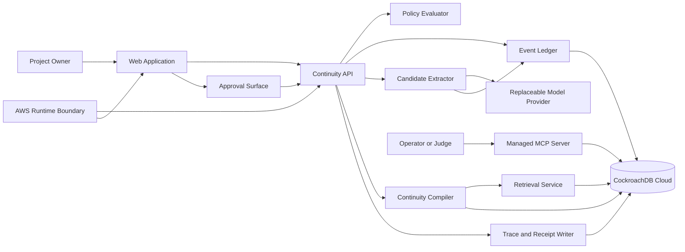

# System Overview

## Product boundary

Cockroach Continuity is a project-scoped continuity ledger for agentic work. It captures evidence, governs durable memory promotion, compiles a current project state, and produces a provenance-backed resume brief.

The system is not a transcript search toy. The differentiator is the separation between:

- what happened
- what the agent inferred
- what the user approved
- what is currently relevant
- what was attempted by a model or provider

## Primary actors

| Actor | Authority |
|---|---|
| Project owner | Creates projects, approves durable assertions, changes policy, resets continuity |
| Agent runtime | Proposes candidates, retrieves evidence, compiles briefs, never self-approves durable identity claims |
| Application operator | Maintains infrastructure and inspects runtime health; does not gain product-user authority by default |
| Judge or evaluator | Receives bounded demo access and read-only inspection capability |
| Model provider | Supplies inference only; owns no durable continuity state |

## Logical components

## Layer model

1. **Experience layer**
   - project workspace
   - approval queue
   - continuity brief
   - provenance inspector

2. **Application control plane**
   - policy evaluator
   - authorization
   - approval rules
   - retrieval posture
   - idempotency and receipts

3. **Continuity plane**
   - candidate extraction
   - evidence linking
   - continuity compilation
   - open loops, decisions, rejected paths, next actions

4. **Durable data plane**
   - canonical event ledger
   - approved assertions
   - continuity snapshots
   - embeddings and vector indexes
   - traces and receipts

5. **Replaceable inference plane**
   - model calls
   - provider adapters
   - embedding adapters

6. **Inspection plane**
   - Managed MCP Server
   - read-only database inspection
   - audit and demo verification

## Core boundaries

### Ledger versus continuity

The ledger records canonical events and user decisions. Continuity state is a derived read model compiled from eligible evidence. Recompiling continuity must not rewrite the event ledger.

### Continuity versus identity

Project state describes the project. It must not silently become a durable claim about the person operating it. Personal traits require a separate consent and governance boundary.

### Retrieval versus truth

Vector similarity proposes relevant evidence. It does not determine whether an assertion is true, approved, current, or in scope.

### Compute versus ownership

Models and AWS services execute work. CockroachDB stores durable continuity. No provider response, cache entry, prompt state, or container filesystem becomes canonical truth by accident.

## Minimum product surface

The hackathon build should expose only:

- create or select one project
- append project events
- inspect candidate continuity assertions
- approve or reject candidates
- start a new session or switch model
- generate a continuity brief
- inspect provenance and retrieval reasons

Additional features require evidence that they strengthen the core demonstration.
