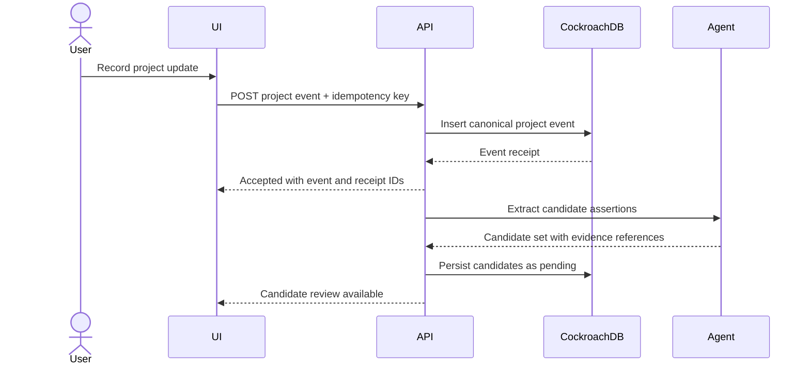
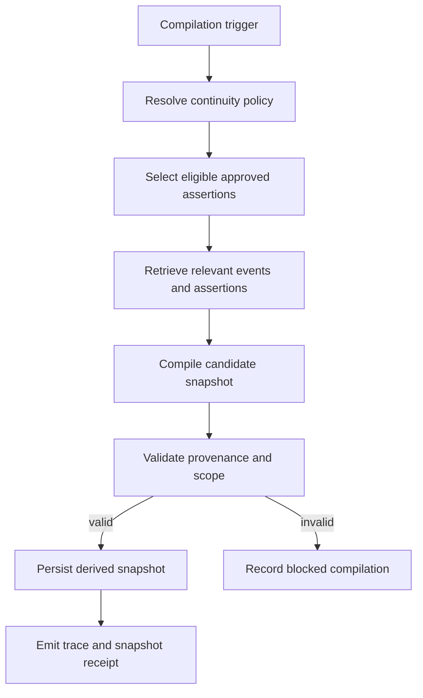

# Critical Flows

## 1. Event capture and candidate generation

Acceptance of the project event means the event write committed. It does not imply that candidate extraction or continuity compilation completed.

## 2. Approval and durable promotion

1. The UI presents the candidate statement, type, source evidence, confidence, sensitivity, and proposed scope.
2. The user chooses approve, reject, revise, or defer.
3. The API persists the decision and, when approved, creates or versions a `MemoryAssertion` in one transaction.
4. An operation receipt records the decision identity and idempotency key.
5. Downstream continuity compilation is triggered after the transaction commits.

No background worker may infer approval from silence, repeated mention, high confidence, or semantic similarity.

## 3. Continuity compilation

The compiler consumes governed evidence. It must not widen scope outside policy or use rejected and revoked assertions as active truth.

## 4. Resume across sessions or models

1. A new session starts with no provider-local memory assumption.
2. The application resolves project and continuity policy.
3. The retrieval service selects eligible assertions and supporting events.
4. The compiler produces a brief containing decisions, constraints, open loops, rejected paths, and next actions.
5. The brief cites exact source assertion IDs and retrieval reasons.
6. A selected model receives the compiled brief as context.
7. Switching providers repeats the same durable retrieval path.

The demo should visibly show that the second provider resumes from CockroachDB-backed state rather than hidden chat memory.

## 5. Retry and replay

- Equivalent write intent uses the same idempotency key.
- A duplicate request returns the prior receipt or a deterministic duplicate outcome.
- A new execution attempt receives a new attempt ID.
- The canonical event is not duplicated.
- Receipt-claim failure is visible and does not silently continue as a novel write.

## 6. Retrieval trace

Each retrieval run records:

- project and policy version
- query or trigger
- candidate identifiers
- vector scores
- eligibility filters
- exclusion reasons
- selected evidence
- widening reason, if any
- snapshot or brief produced

The user-facing explanation may summarize this trace. Raw operational diagnostics stay behind the operator boundary.

## 7. Managed MCP inspection

The Managed MCP Server is a bounded inspection and operations surface:

- read project events, approved assertions, snapshots, and traces
- inspect schema and query behavior
- demonstrate the CockroachDB memory layer to judges
- preserve audit logs

The baseline demo posture is read-only. Application writes go through the governed API, not arbitrary MCP mutation.

## Failure policies

| Failure | Required behavior |
|---|---|
| Model candidate extraction fails | Preserve event, record failed attempt, allow retry |
| Vector query fails | Fall back to policy-approved structured retrieval or return a visible blocked state |
| Compilation fails | Preserve prior accepted snapshot and record blocked attempt |
| Provider switches | Rehydrate from durable state; do not claim uninterrupted provider memory |
| Duplicate write | Return prior receipt or deterministic duplicate result |
| MCP unavailable | Application remains functional; inspection proof is blocked |
| AWS runtime restart | Reconnect to CockroachDB and resume from durable state |
