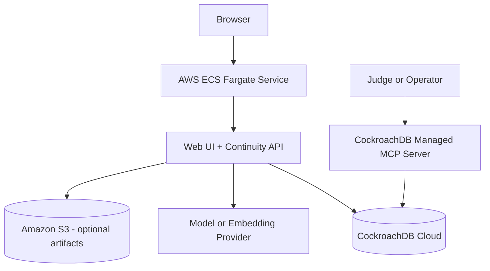

# Deployment Topology

## Recommended hackathon topology

## AWS role

The recommended baseline is one containerized application service on **Amazon ECS Fargate**. It may serve the web UI and FastAPI application together for the hackathon slice.

Why this boundary:

- one deployable unit
- visible, meaningful AWS runtime use
- no queue or serverless complexity required before the core loop works
- straightforward public demo URL
- container parity with local development

Amazon S3 is optional for artifact bytes. AWS Lambda may be introduced later for bounded compiler or embedding jobs only if it improves the proof rather than multiplying failure modes.

## CockroachDB role

CockroachDB Cloud provides:

- canonical transactional continuity records
- distributed vector indexing for semantic retrieval
- one consistency boundary for approvals, provenance, and retrieval metadata
- Managed MCP Server inspection

CockroachDB is not merely initialized. The demo must visibly depend on persisted state and vector retrieval.

## Managed MCP Server role

The MCP integration is an inspection and operations boundary, not hidden plumbing:

- demonstrate stored events, assertions, snapshots, and traces
- inspect indexes and query behavior
- preserve audit visibility
- remain read-only for judge or operator access

## Environment model

| Environment | Purpose | Data posture |
|---|---|---|
| local | development and unit tests | synthetic fixtures |
| demo | public hackathon deployment | seeded synthetic data only |
| proof | repeatable verification run | resettable fixture set and captured traces |

No production environment is claimed by this architecture.

## Configuration

Expected environment-managed settings include:

- CockroachDB connection URL
- database role credentials
- model provider credentials
- embedding provider and model ID
- AWS region and runtime settings
- S3 bucket name when enabled
- application origin and authentication mode
- trace retention configuration

Secrets must live in AWS-managed environment configuration or a secrets service, never in the repository.

## Availability posture

CockroachDB may provide distributed durability, but application availability also depends on:

- ECS service health
- network connectivity
- provider availability
- schema compatibility
- authentication services

The project must not claim global resilience merely because the database is distributed. The demo claim should remain bounded to continuity surviving application restart and provider change.
